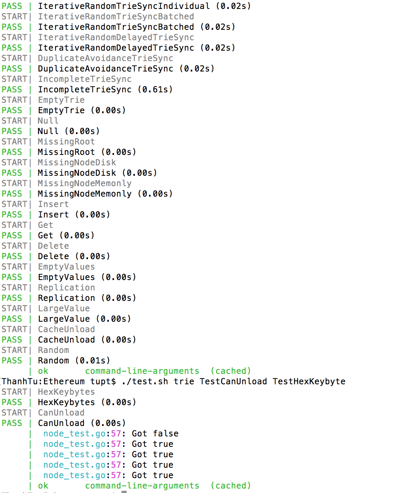

## Go Ethereum - Test & Benchmark

#### Setup environment

```bash
make -p $GOPATH/src/github.com/ethereum
ln -s $PWD $GOPATH/src/github.com/ethereum/go-ethereum
```

#### Run test & benchmark

```bash
# ./test.sh folder method_pattern
./test.sh trie TestCanUnload TestHexKeybyte
./bench.sh trie BenchmarkHash BenchmarkProve
```

#### Auto update import

```bash
# install goimports
go get -u golang.org/x/tools/cmd/goimports
# install GoSublime at https://github.com/DisposaBoy/GoSublime
# Open the GoSublime/Settings User and make it look like this:
{
    "fmt_cmd": ["goimports"]
}
```


